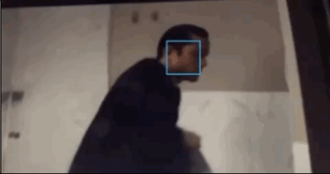
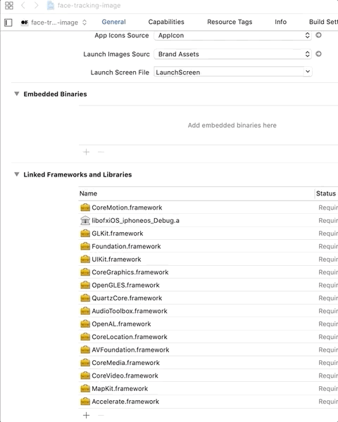

# ofxiOSFaceTracking
openFrameworks addon that uses iOS native Machine Learning toolkit (CoreML) to detect faces. 

## installation

ofxiOSFaceTracking needs  iOS 11 or later.

After you have created the project:

1. add Vision SDK

## About
While working on [tramontanaCV](https://tramontana.xyz/tramontanacv) I stumbled upon the difficulties of working with [ofxFaceTracker](https://github.com/kylemcdonald/ofxFaceTracker) and [ofxFaceTracker2](https://github.com/HalfdanJ/ofxFaceTracker2). I wanted to create a lightweight and fast addon to work with CoreML.

## Developer guide
ofxiOSFaceTracking doesn't have dependencies and it works with ARC enabled or not.

Tested on iOS 12 and of_ios 0.10.1.

## Examples
The two examples show how to use the addon on a video feed or on a static image.

